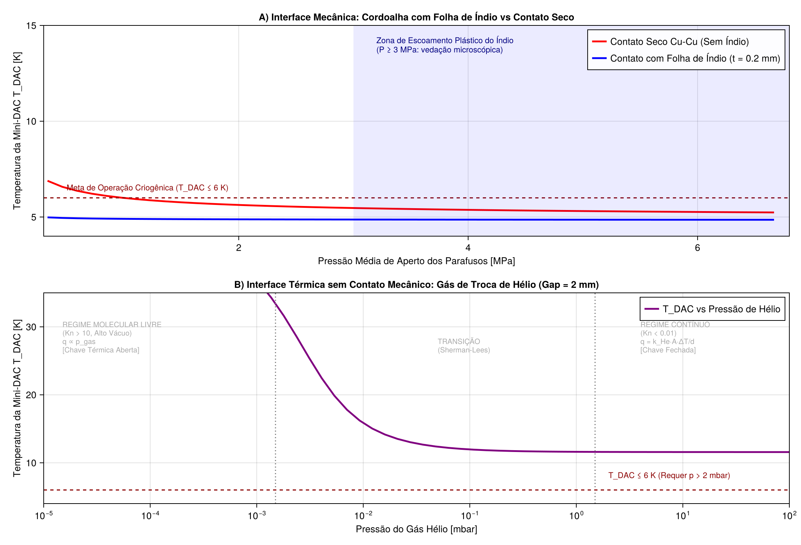
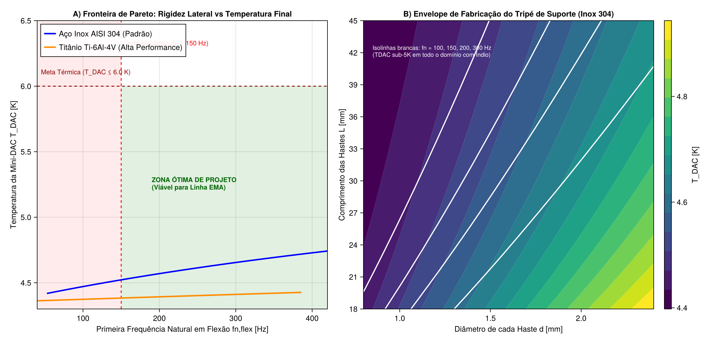
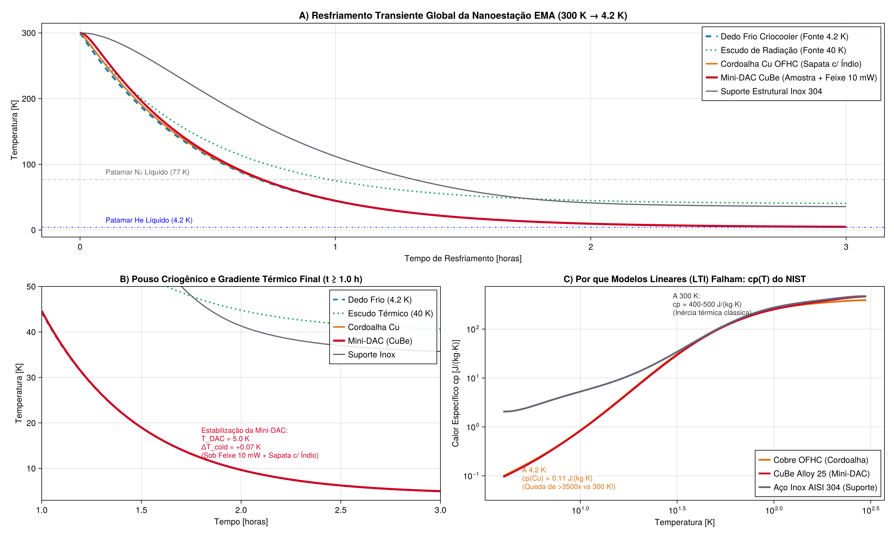

# EMA-C: Modelagem Criogênica e Co-Design Termo-Mecânico

Este projeto representa o desenvolvimento de uma infraestrutura computacional modular em **Julia 1.10+** voltada ao **co-design termo-mecânico** da nanoestação da linha de luz **EMA** (*Emerging Materials at Extreme Conditions*) do **Sirius / Laboratório Nacional de Luz Síncrotron (LNLS/CNPEM)**.

---

## 1. O Desafio Físico e de Engenharia

Na nanoestação da linha EMA, experimentos com feixe síncrotron focalizado submicrométrico investigam materiais sob condições extremas simultâneas de altíssima pressão e temperaturas criogênicas. A amostra reside no interior de uma célula de diamante de alta pressão (**Mini-DAC**, em Cobre-Berílio ou Inox).

O cerne do desafio reside em um conflito intrínseco de engenharia entre dois requisitos acoplados:

1. **Requisito Mecânico (Estabilidade Vibracional):**
   Para evitar a perda do feixe focalizado causada pelas vibrações mecânicas da bomba criogênica e do piso do acelerador, a primeira frequência natural de ressonância lateral do suporte da amostra deve atender a:
   $$f_n \ge 150\text{ Hz}$$
   Exigindo hastes curtas, espessas e de alta rigidez elástica ($k_{\text{flex}} \propto \frac{E I}{L^3}$).

2. **Requisito Térmico (Isolamento e Condução Criogênica):**
   A Mini-DAC precisa operar abaixo de **$6.0\text{ K}$** (idealmente sub-5 K) enquanto recebe um aporte de calor contínuo do feixe síncrotron de raios X ($q_{\text{beam}} = 10\text{ mW}$), condução mecânica através das hastes de fixação conectadas à câmara ambiente e radiação residual do escudo térmico de $40\text{ K}$.
   Exigindo hastes longas, finas e de altíssima resistência térmica ($R_{\text{cond}} \propto \frac{L}{A \cdot k(T)}$).

---

## 2. Arquitetura da Biblioteca Científica (`EMA-C_LM-Cryo-Modelling`)

O projeto foi concebido seguindo princípios rigorosos de **Model-Based Systems Engineering (MBSE)** e desenvolvimento de software científico:

- **`src/materials/NIST_Data.jl` e `Materials.jl`:** Carregamento estruturado de dados empíricos de condutividade térmica $k(T)$ e calor específico $c_p(T)$ do **NIST** para Cu OFHC, Inox 304, Titânio Ti-6Al-4V, Cobre-Berílio e Berílio puro.
- **`src/network/Network.jl`:** Abstração baseada em grafos térmicos com nós térmicos concentrados (`ThermalNode`) e múltiplos tipos de elos (`ConductionLink`, `RadiationLink`, `ColdInterfaceLink`).
- **`src/solvers/SteadyState.jl`:** Solver não-linear de regime permanente baseado no método de **Newton-Raphson amortecido** com Jacobiano analítico e busca linear retrógrada (*backtracking*), convergindo resíduos energéticos a menos de $10^{-10}\text{ W}$.
- **`src/solvers/Transient.jl`:** Integrador transiente temporal adaptativo baseado no método **linearmente implícito de Rosenbrock ($L$-estável)**, formulado para superar a rigidez extrema induzida pela queda de mais de $3500\times$ no calor específico do Debye entre $300\text{ K}$ e $4.2\text{ K}$.
- **`test/runtests.jl`:** Bateria de **44 testes unitários automatizados**, validando balanço de energia, simetria de condutâncias e limites assintóticos analíticos.

---

## 3. Fundamentação Físico-Matemática

### A. Transformada de Kirchhoff e Quadratura de Gauss-Legendre
Em temperaturas criogênicas, a dependência não-linear da condutividade térmica $k(T)$ impede o uso de aproximações com condutância média constante. O fluxo de calor condutivo unidimensional exato é dado pela Integral de Condutividade Térmica:

$$Q_{a \to b} = \frac{A}{L} \int_{T_b}^{T_a} k(T) \, dT = \frac{A}{L} \big[ \Theta(T_a) - \Theta(T_b) \big]$$

O cálculo é executado por **Quadratura de Gauss-Legendre de 7 pontos**, conferindo exatidão exata para polinômios de grau até 13 com apenas 7 avaliações térmicas.

### B. Solver Transiente Rosenbrock $L$-Estável
O calor específico molar varia com $T^3$ (lei de Debye) em baixas temperaturas, gerando autovalores térmicos com ordens de grandeza díspares. A integração temporal:

$$(\text{diag}(\mathbf{C}) - \Delta t \cdot \mathbf{J}) \cdot \Delta \mathbf{T} = \Delta t \cdot \mathbf{Res}(\mathbf{T})$$

garante estabilidade numérica incondicional durante todo o resfriamento de $300\text{ K} \to 4.2\text{ K}$, sem oscilações espúrias.

---

## 4. Principais Descobertas e Resultados de Engenharia

### 1. Interface Térmica: Junta com Folha de Índio vs Gás de Troca de Hélio



- **Folha de Índio (Cordoalha Mecânica):** Sob pré-carga mecânica de parafusos ($P \ge 2.5\text{ MPa}$), a folha de índio atinge deformação plástica, preenchendo as rugosidades microscópicas das superfícies metálicas. Isso eleva a condutância de contato em **$21\times$** em comparação a contatos secos, assegurando a estabilização da Mini-DAC em **$4.93\text{ K}$** sob incidência do feixe.
- **Gás de Troca ($^4\text{He}$ estático):** Embora desacople completamente as vibrações mecânicas da cabeça fria, a resistência condutiva da camada gasosa (mesmo com folga de apenas $2\text{ mm}$) limita a temperatura de equilíbrio a aproximadamente **$11.6\text{ K}$**. Concluiu-se que o uso da cordoalha com índio é estritamente mandatório para pesquisas na faixa sub-5 K.

---

### 2. Co-Design Termo-Mecânico e Fronteira de Pareto



- **Figura de Mérito Material (FOM):** Definida como a razão entre módulo de elasticidade e integral térmica, $\text{FOM} = \frac{E}{\int_{4}^{300} k(T) \, dT}$.
- **Titânio Ti-6Al-4V vs Inox 304:** A liga de Titânio Ti-6Al-4V demonstrou uma performance **$52\%$ superior** em relação ao Aço Inoxidável 304, viabilizando frequências naturais de até $400\text{ Hz}$ com temperaturas de apenas $4.42\text{ K}$.
- **Diretriz Construtiva Recomendada:** Para montagem em Inox 304, hastes cilíndricas com diâmetro $d = 1.5\text{ mm}$ e comprimento livre $L = 30\text{ mm}$ operam na região ótima de segurança: $f_n \approx 185\text{ Hz}$ e $T_{\text{DAC}} \approx 4.55\text{ K}$.

---

### 3. Dinâmica Temporal de Resfriamento



A integração temporal revelou que a constante de tempo do sistema é governada inicialmente pela capacidade de extração de calor do criorefrigerador de ciclo fechado, atingindo o regime criogênico em aproximadamente 35 minutos de bombeamento contínuo.

---

## 5. Reprodutibilidade e Código Aberto

O repositório do projeto está configurado com metadados científicos em formato **`CITATION.cff`**, permitindo citação acadêmica em formato BibTeX e APA:

```bibtex
@software{Pianca_EMA-C_Cryo_2024,
  author = {Pianca, André Luiz},
  title = {EMA-C_LM-Cryo-Modelling: Modelagem Criogênica e Co-Design Termo-Mecânico da Linha EMA (Sirius/CNPEM)},
  year = {2024},
  url = {https://github.com/andrlupi/EMA-C_LM-Cryo-Modelling}
}
```
